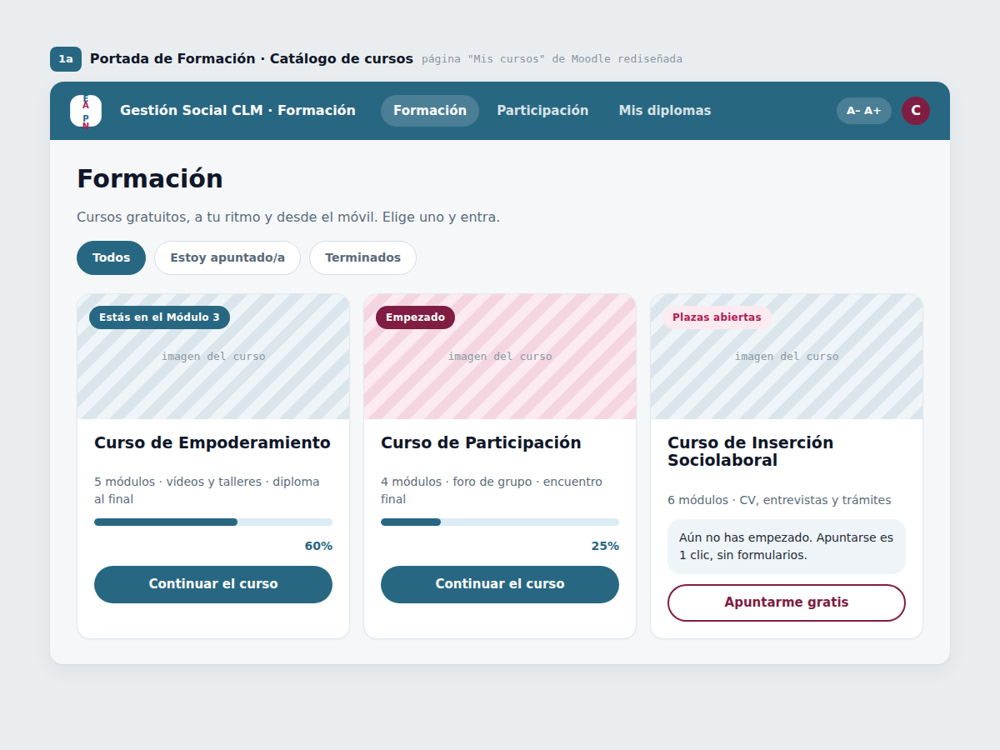

# Gestión Social CLM · Aula Virtual EAPN-CLM

Tema de **Moodle** e implementación del sistema de diseño de **EAPN Castilla-La Mancha**
(Red Europea de Lucha contra la Pobreza y la Exclusión Social en Castilla-La Mancha),
a partir del diseño `web_formacion`.

Cubre las cinco áreas del diseño: web pública, acceso, **aula virtual (Moodle)**,
panel de gestión y comunicaciones/diplomas.



---

## Qué contiene

| Carpeta | Qué es | Naturaleza |
|---|---|---|
| **`theme/eapnclm/`** | Tema **instalable** de Moodle (hijo de Boost). Reestiliza el aula virtual completa: barra superior, navegación, catálogo «Mis cursos», páginas de curso (formato temas), actividades, progreso y login. | Plugin de Moodle |
| **`site/`** | Previsualizaciones **HTML/CSS estáticas** y fieles de **todas** las pantallas del diseño. Sirven para revisar el diseño sin instalar Moodle y para cubrir las partes que no son nativas de Moodle (web pública, panel de gestión, correos, diplomas). | Maquetas estáticas |

Los tokens de diseño (colores, tipografía, formas) son **los mismos** en el tema
(`theme/eapnclm/scss/pre.scss`) y en las maquetas (`site/assets/eapnclm.css`), así que
ambos se ven idénticos.

### Empezar a mirar

Abre **`site/index.html`** en el navegador: es la portada-índice que enlaza las 13 pantallas.

---

## Sistema de diseño

| Token | Valor | Uso |
|---|---|---|
| Primario (petróleo) | `#286782` | Barra del aula, botones, cabeceras de curso, login, enlaces |
| Granate | `#801D43` | CTA de acción: «Entrar al aula», «Apuntarme», «Seguir por donde iba» |
| Acento (magenta) | `#B01E54` | Etiquetas de sección y enlaces «Avisadme cuando abra» |
| Navy | `#0F172A` | Titulares |
| Petróleo-navy | `#1F4B5F` | Barra lateral del panel de gestión |
| Verde | `#1E8E5A` | Actividad completada / validado |
| Tinte azul / rosa | `#EEF4F7` / `#FBEAF0` | Fondos suaves, badges, placeholders |

- **Titulares:** Poppins (geométrica redondeada). **Texto:** Inter.
- **Formas:** tarjetas muy redondeadas (radio 1rem) y botones tipo píldora.
- **Tono:** lenguaje claro, teléfono de ayuda siempre visible, «1 clic, sin papeleo».

---

## Mapa de pantallas (diseño → archivo)

**1 · Web pública**
- `2b` Portada Formación → `site/web-formacion.html`
- `4a` Participa → `site/web-participa.html`
- `4b` Infórmate → `site/web-informate.html`
- `4c` Quiénes somos → `site/web-quienes-somos.html`

**2 · Acceso**
- `2a` Login del aula (participantes) → `site/acceso-aula.html`
- `5a` Login del panel (gestores, 2FA) → `site/acceso-panel.html`

**3 · Aula virtual · Moodle** *(lo que renderiza el tema instalable)*
- `1a` Catálogo «Mis cursos» → `site/aula-catalogo.html`
- `1b` Curso · Empoderamiento (formato temas + índice) → `site/aula-curso-empoderamiento.html`
- `1c` Curso · Participación → `site/aula-curso-participacion.html`
- `1d` Curso · Inserción (antes de apuntarse) → `site/aula-curso-insercion.html`
- `1e`/`1f` Actividad (vídeo) + versión móvil → `site/aula-actividad.html`

**4 · Panel de gestión**
- `6a` Convocatorias → `site/panel-convocatorias.html`
- `6b` Inscripciones y justificantes → `site/panel-inscripciones.html`

**5 · Comunicaciones y diplomas**
- `3a` Correo de bienvenida → `site/correo-bienvenida.html`
- `3b`/`3c` Diploma (anverso y reverso) → `site/diploma.html`

---

## Instalar el tema de Moodle

Requiere **Moodle 4.1 o superior** (el tema es hijo de Boost).

### Opción A · copiar la carpeta

```bash
# desde la raíz de tu instalación de Moodle
cp -r theme/eapnclm  /ruta/a/moodle/theme/eapnclm
```

Luego en Moodle:

1. **Administración del sitio → Notificaciones** — Moodle detecta el plugin y lo instala.
2. **Administración del sitio → Apariencia → Temas → Selector de temas** — elige
   **«EAPN-CLM · Gestión Social CLM»** y guarda.
3. (Opcional) **Apariencia → EAPN-CLM** para ajustar los colores de marca o añadir SCSS propio.

### Opción B · ZIP desde la interfaz

```bash
cd theme && zip -r eapnclm.zip eapnclm
```

**Administración del sitio → Plugins → Instalar plugins** y sube `eapnclm.zip`
(el tipo de plugin es *Theme (theme)*).

### Configuración del tema

En **Apariencia → EAPN-CLM** hay:

- **Color primario / secundario / acento** — selectores de color, por si cambia la marca.
- **Preset** — preset SCSS base (por defecto el de Boost).
- **SCSS inicial / SCSS final** — para personalización avanzada.

---

## Recomendaciones para reproducir el aula al 100 %

El tema aporta el **aspecto**. Para que el aula se comporte como en el diseño:

- **Formato de curso:** usa el formato **«Temas»** (Topics) → coincide con `1b`/`1c`.
- **Seguimiento de finalización** activado → los tics verdes y el «X de N hechas».
- **Barra de progreso:** bloque *Estado de finalización del curso* o el propio indicador del formato.
- **Diplomas (`3b`/`3c`):** plugin **`mod_customcert`** (Custom certificate). Las plantillas
  de `site/diploma.html` sirven de referencia visual para configurar anverso y reverso.
- **Web pública, panel de gestión y correos** no son parte nativa de un tema de Moodle:
  se entregan como maquetas en `site/` para maquetar en el portal público / backend a medida
  o como base de plantillas de correo.

---

## Notas técnicas

- El tema pasa `php -l` en todos sus archivos y el SCSS compila sin errores.
- No almacena datos personales (ver `privacy:metadata`).
- Cadenas de idioma en **español** e **inglés**.

---

## Utilidad heredada

El repositorio incluye además un pequeño utilitario Python previo (`calculator.py` y `tests/`),
ajeno a este diseño y conservado tal cual.
